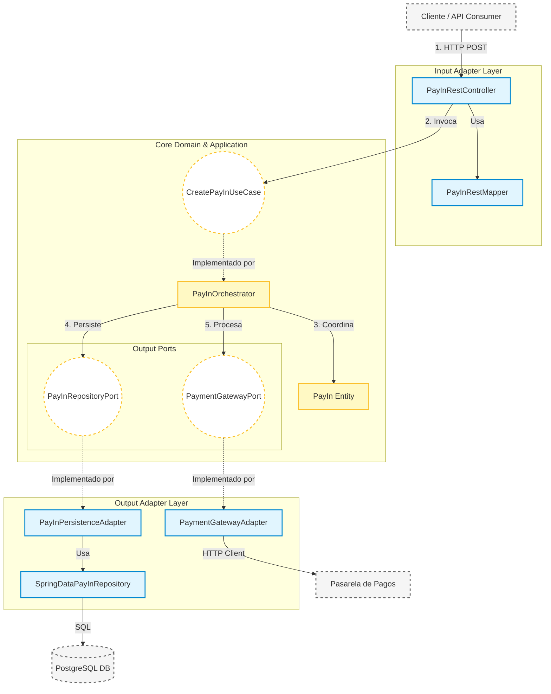

# TumiPay Technical Test

Este repositorio contiene la implementación del componente de ingestión de pagos (PayIn) para la plataforma TumiPay. El sistema ha sido diseñado priorizando la desacoplación, la testabilidad y la escalabilidad mediante arquitectura hexagonal

### Patrones de diseño aplicados

La solución implementa una variedad de patrones para garantizar desacoplamiento, testabilidad y mantenibilidad, clasificados por su tipología:

#### 1. Patrones arquitectónicos

* **Arquitectura hexagonal (Ports & Adapters):**
  - *Aplicación:* Separación estricta entre el núcleo (domain), la capa de orquestación (application) y los detalles técnicos (infrastructure).
  - *Ejemplo:* `PayInRepositoryPort` (puerto en Dominio) definido como interfaz e implementado por `PayInPersistenceAdapter` (adaptador en Infraestructura).


#### 2. Domain-Driven Design (patrones tácticos)

* **Entity (Entidad):** Objetos definidos por su identidad única y ciclo de vida mutable.
  - *Ejemplo:* `PayIn` (posee un ID único y transita por estados: `CREATED` -> `VALIDATED` -> `PROCESSED`).


* **Value Object (Objeto de Valor):** Objetos inmutables definidos por sus atributos, sin identidad propia.
  - *Ejemplo:* `Money` (encapsula importe y moneda con validaciones) y `PayInId` (encapsula el UUID).


* **Aggregate Root:** La entidad principal que garantiza la consistencia de un grupo de objetos.
  - *Ejemplo:* `PayIn` actúa como raíz; cualquier cambio de estado o modificación de saldo debe pasar por sus métodos.


* **Repository Interface:** Abstracción de la colección de objetos, agnóstica al almacenamiento.
  - *Ejemplo:* `PayInRepositoryPort`.


#### 3. Patrones creacionales (GoF)

* **Builder Pattern:** Facilita la construcción legible de objetos complejos.
  - *Ejemplo:* Uso de `@Builder` (Lombok) en `PayIn.java` y `PayInJpaEntity.java` para evitar constructores telescópicos.


* **Factory Method (Static Factory):** Métodos estáticos que encapsulan la lógica de creación y validación invariante.
  - *Ejemplo:* `PayIn.create(...)` y `PayInId.of(...)`. Garantizan que nunca se instancie un objeto de dominio en un estado inválido.


#### 4. Patrones estructurales (GoF)

* **Adapter Pattern:** Adapta una interfaz requerida por el dominio a una implementación específica.
  - *Ejemplo:* `PayInPersistenceAdapter` adapta el puerto `PayInRepositoryPort` al repositorio de Spring Data (`SpringDataPayInRepository`).


* **DTO (Data Transfer Object):** Objeto para transportar datos entre procesos, aislando el dominio de la capa de presentación.
  - *Ejemplo:* `PayInRequest` y `PayInResponse` implementados como **Java Records**.


* **Facade (Fachada):** Proporciona una interfaz unificada y simplificada para un flujo complejo.
  - *Ejemplo:* `PayInOrchestrator` actúa como fachada para el Controlador REST, coordinando repositorios, validaciones y pasarelas sin exponer la complejidad al cliente HTTP.


#### 5. Patrones de comportamiento & otros

* **Dependency Injection (Inversión de Control):** Desacoplamiento de componentes.
  - *Ejemplo:* Inyección vía constructor (`@RequiredArgsConstructor`) en `PayInOrchestrator` y `PayInPersistenceAdapter`.


* **Command Pattern:** Encapsula todos los datos de una solicitud en un objeto independiente.
  - *Ejemplo:* `CreatePayInCommand` transporta la intención del usuario hacia el caso de uso.


* **Guard Clause (Cláusula de Guarda):** Validaciones defensivas al inicio de métodos.
  - *Ejemplo:* Validaciones en `Money` (monto negativo) o en `PayIn.validateStateTransition()` para fallar rápido (Fail Fast).


* **Exception Translation:** Traducción de excepciones técnicas o de dominio a respuestas estándar.
  - *Ejemplo:* `GlobalExceptionHandler` captura `PayInDomainException` y la transforma en una respuesta HTTP con formato estandarizado (RFC 7807).


## Decisiones arquitectónicas

Se han tomado decisiones de diseño deliberadas para garantizar la mantenibilidad, robustez y escalabilidad del sistema a largo plazo.

### Framework Agnostic Domain

El paquete `domain` se mantiene puro (ava 17), sin dependencias de Spring Boot, Jakarta EE o Lombok.

Esto garantiza que las reglas de negocio sean portables, sobrevivan a cambios de framework y sean testables unitariamente con ejecución rápida sin levantar contextos pesados.

### Orquestación síncrona vs coreografía

Se eligió un patrón de orquestador central (`PayInOrchestrator`) sobre un modelo de eventos distribuidos.

El proceso de pago requiere transaccionalidad estricta y consistencia inmediata. Si falla un paso (ej: saldo insuficiente), el usuario debe recibir el feedback al instante en la respuesta HTTP, no eventualmente.

### Segregación de constantes (No "God Class")

Para evitar el anti-patrón de "Clases Gigantes" de constantes y respetar el Principio de Responsabilidad Única (SRP), se aplicó una segregación semántica estricta:

* **`SchemaConstants`:** Nombres de tablas y columnas (Capa de Persistencia).
* **`RestConstants`:** Rutas API, Headers y claves JSON (Capa de Entrada).
* **`MessageConstants`:** Claves de internacionalización (i18n), mensajes de validación y logs (Transversal).

### Null Safety & programación defensiva

Se implementó una política de **"Zero Null Tolerance"** en los bordes del hexágono.

* **Estrategia:** En lugar de confiar ciegamente en anotaciones, se implementaron **Guard Clauses explícitas** con `Objects.requireNonNull` y validaciones en los constructores.
* **Resultado:** Esto garantiza el principio *Fail Fast*: el sistema falla inmediatamente al intentar construir un objeto inválido, evitando `NullPointerException` oscuros en capas profundas.

### Estrategia de Identificadores (UUID)

Uso de **UUID v4** para los identificadores de transacción (`PayInId`).

* **Seguridad:** Evita la enumeración secuencial.
* **Escalabilidad:** Permite generar IDs únicos sin coordinarse con una base de datos central, facilitando futura distribución (Database Sharding).


¡Claro que sí! Para elevar el nivel y hacerlo sonar aún más como un **Arquitecto de Software** o **Tech Lead**, podemos enfatizar el concepto de *Domain Primitives* y la garantía de integridad de datos.

Aquí tienes una versión mejorada, más contundente y profesional:


### Value Objects Ricos

Se mitigó el anti-patrón de **"Obsesión por los Primitivos"** reemplazando tipos de datos genéricos (`BigDecimal`, `String`) por objetos de valor semánticos con comportamiento encapsulado (`Money`, `PayInId`).

Esto centraliza las invariantes de negocio (ej: *"el dinero no puede ser negativo"*, *"un ID debe respetar el estándar UUID"*) directamente en la estructura de datos.

**Impacto:** Garantiza la integridad referencial desde el momento de la instanciación. Es imposible crear un objeto de dominio en un estado inválido, lo que elimina la necesidad de validaciones defensivas repetitivas en la capa de servicios.


## Suposiciones

Se han realizado las siguientes asunciones para delimitar el alcance del proyecto técnico y centrar el esfuerzo en la arquitectura de ingestión de pagos:

### 1. Seguridad perimetral (API Gateway)

Se asume que este microservicio opera dentro de una red de confianza (VPC) o detrás de un **API Gateway** corporativo.

* **Autenticación:** El Gateway se encarga de validar el token de seguridad (OAuth2/JWT) y propaga un header de confianza (ej: `X-User-Id`) o el mismo token validado hacia este microservicio.
* **Protección:** El control de *Rate Limiting*, *Throttling* y protección WAF se realiza en el perímetro.

### 2. Integración con core bancario

El sistema interactúa con un "Core Bancario" o Pasarela simulada.

* **Escenario Real:** En producción, esta integración idealmente sería asíncrona para tolerancia a fallos.
* **Alcance de la Prueba:** Para efectos de este ejercicio, se modela como una comunicación síncrona HTTP, asumiendo que el proveedor externo responde en tiempos aceptables (< 3s).

### 3. Gestión de divisas

Aunque el dominio soporta operaciones multimoneda mediante el Value Object `Money`, se asume que:

* **Tasa de Cambio:** La conversión de divisas es responsabilidad de la pasarela de pagos antes de liquidar. El sistema PayIn registra y custodia el monto en la moneda original solicitada por el cliente.

### 4. Idempotencia del cliente

El cliente consumidor del API es el responsable primario de garantizar la unicidad de las solicitudes de pago.

El cliente debe generar y enviar un `reference_code` (UUID) único por intento de transacción. El sistema garantiza la integridad mediante una `UNIQUE CONSTRAINT` en base de datos, rechazando duplicados con un error 409 (Conflict).

## Riesgos identificados

A pesar de la robustez del diseño, se han identificado los siguientes riesgos técnicos y operativos, junto con sus estrategias de mitigación:

### Latencia en pasarela externa

El flujo del orquestador espera la respuesta síncrona de la pasarela de pagos.

* **Riesgo:** Si el proveedor externo tiene tiempos de respuesta altos (> 5s) o sufre una degradación, los hilos del servidor Tomcat se quedarán bloqueados esperando I/O (*Thread Starvation*), pudiendo agotar el pool de conexiones y causar una denegación de servicio en cascada.
* **Mitigación actual:** Configuración de `readTimeout` y `connectTimeout` agresivos en el cliente HTTP para liberar recursos rápidamente.
* **Mejora futura:** Implementar un Circuit Breaker (con Resilience4j) para "cortar el circuito" si el proveedor falla repetidamente, devolviendo un error inmediato (*Fail Fast*) sin saturar el sistema.

### Inconsistencia transaccional

Existe una ventana de tiempo crítica entre el cobro exitoso en la pasarela externa y la actualización del estado en la base de datos local.

* **Riesgo:** Si el sistema cobra el dinero (Pasarela responde 200 OK) pero falla al guardar el estado `PROCESSED` en la BD (ej: caída de red, crash de la JVM justo en esa línea), la transacción quedará localmente en limbo (`CREATED` o `VALIDATED`), aunque el usuario ya pagó.
* **Mitigación:** Implementación requerida de un proceso Batch de Reconciliación (Job programado/Cron) que consulte periódicamente a la pasarela por transacciones en estados intermedios y sincronice el estado final.

### Condiciones de carrera (Concurrency)

**Riesgo:** En entornos de alta concurrencia, dos hilos podrían intentar procesar el mismo `PayIn` o debitar la misma cuenta simultáneamente.

**Mitigación:**
* **Nivel base de datos:** Idempotencia garantizada mediante `UNIQUE CONSTRAINT` en la columna `reference_code` (el motor de BD rechazará físicamente el duplicado).
* **Nivel aplicación:** La pasarela externa actúa como segunda barrera de validación de duplicidad.
* **Mejora futura:** Implementar Optimistic Locking (campo `@Version` en JPA) en la entidad `Account` para prevenir "Lost Updates" durante el cálculo de saldos.

## Arquitectura Implementada

La aplicación sigue estrictamente los principios de **Arquitectura Hexagonal (Ports & Adapters)**, priorizando la mantenibilidad y el desacoplamiento.

### Estructura de Capas

El diseño respeta la regla de dependencia: el código fuente solo apunta hacia adentro. Las capas internas no conocen nada de las externas.

#### Capa de Dominio (Core)

Es el núcleo de la aplicación y reside en el centro del hexágono.

**Responsabilidad:** Define las reglas de negocio, entidades, invariantes y lógica pura.

**Componentes:**
* **`PayIn` (Aggregate Root):** Contiene la lógica de cambio de estado y validaciones de negocio .


* **`Ports` (Interfaces):** Contratos que definen *qué* necesita el dominio (ej. `PayInRepositoryPort`), sin saber *cómo* se implementa.


* **Características:** **Java 17 estándar**. Cero dependencias de Spring Boot, Hibernate o librerías de terceros.


#### Capa de aplicación (Orquestación)

Rodea al dominio y orquesta los casos de uso de la aplicación.

**Responsabilidad:** Coordinar el flujo de datos entre los adaptadores y el dominio, manejar transacciones y seguridad.

**Componentes:**
* **`PayInOrchestrator`:** Implementa el caso de uso `CreatePayInUseCase`. Recibe comandos, orquesta validaciones con repositorios, delega la lógica de negocio a la entidad `PayIn` y asegura la persistencia atómica.

**Transaccionalidad:** Aquí se definen los límites transaccionales (`@Transactional`) para garantizar la integridad de los datos.


#### Capa de Infraestructura (Adaptadores)

La capa más externa, conteniendo los detalles técnicos ("sucios") y frameworks.

 **Responsabilidad:** Implementar las interfaces definidas por el dominio y adaptar el mundo exterior a la aplicación.

**Input Adapters (Driving):**
* **`PayInRestController`:** Expone el API REST. Recibe HTTP, valida el contrato JSON (Snake Case) y convierte a comandos del dominio .

**Output Adapters (Driven):**
* **`JpaPersistenceAdapter`:** Implementa los puertos de repositorio usando **Spring Data JPA**. Traduce objetos de dominio a Entidades JPA (`@Entity`).


* **`PaymentGatewayAdapter`:** Cliente HTTP que encapsula la comunicación con proveedores de pago externos.

## Diagrama de Componentes (Hexagonal)



_____


## Cómo Ejecutar

Prerrequisitos: Java 17 instalado.

### Correr tests

Ejecutar pruebas unitarias

```bash
./mvnw test
```


### Levantar la aplicación

```bash
./mvnw spring-boot:run
```

La aplicación iniciará generalmente en el puerto `8080`.


## Estructura de carpetas

```
src/main/java/com/tumipay
├── application
│   └── service
│       └── PayInOrchestrator.java       
├── domain
│   ├── exception
│   │   └── PayInDomainException.java
│   ├── model
│   │   ├── PayIn.java                   
│   │   ├── PayInId.java                 
│   │   ├── PayInStatus.java             
│   │   └── Money.java                   
│   └── port
│       ├── in
│       │   └── CreatePayInUseCase.java  
│       └── out
│           ├── PayInRepositoryPort.java 
│           ├── AccountRepositoryPort.java
│           ├── CustomerRepositoryPort.java
│           ├── PaymentMethodRepositoryPort.java
│           └── PaymentGatewayPort.java
└── infrastructure
    ├── adapter
    │   ├── input
    │   │   └── rest
    │   │       ├── PayInRestController.java
    │   │       ├── GlobalExceptionHandler.java
    │   │       ├── constant             
    │   │       │   ├── RestConstants.java
    │   │       │   └── MessageConstants.java
    │   │       ├── dto
    │   │       │   ├── PayInRequest.java
    │   │       │   └── PayInResponse.java
    │   │       └── mapper
    │   │           └── PayInRestMapper.java
    │   └── output
    │       ├── gateway
    │       │   └── PaymentGatewayAdapter.java
    │       └── persistence
    │           ├── PayInPersistenceAdapter.java
    │           ├── JpaAccountRepositoryAdapter.java
    │           ├── constant            
    │           │   └── SchemaConstants.java
    │           ├── entity
    │           │   ├── PayInJpaEntity.java
    │           │   ├── AccountEntity.java
    │           │   └── ... (Otras entidades)
    │           ├── mapper
    │           │   └── PayInJpaMapper.java
    │           └── repository
    │               └── SpringDataPayInRepository.java
    └── config                         
        ├── constant
        │   └── AppConfigConstants.java
        ├── BeanConfig.java
        ├── JacksonConfiguration.java
        ├── MessageConfig.java
        └── OpenApiConfig.java
```


### Configuración de Base de Datos

Al iniciar la aplicación por primera vez, es necesario poblar la base de datos (H2 en memoria) con datos maestros (clientes, métodos de pago, etc.) para que las pruebas manuales o Postman funcionen correctamente.

Ejecute el siguiente script SQL en su cliente de base de datos preferido (o la consola H2):

`insert_data.sql`

Este script se encuentra en la raíz del proyecto.

## Uso del API

### 1. Crear un PayIn (Simular Pago)

**Endpoint:** `POST /v1/payins`

**Body (JSON):**
```json
{
  "customer_id": 1,
  "account_id": 1,
  "payment_method_id": 1,
  "amount": 50000.00,
  "currency": "COP"
}
```

**Respuesta Exitosa (201 Created):**
```json
{
    "id": "123e4567-e89b-12d3-a456-426614174000",
    "status": "PROCESSED",
    "reference_code": "...",
    ...
}
```

### 2. Consultar un PayIn

**Endpoint:** `GET /v1/payins/{id}`

**Ejemplo:** `GET /v1/payins/123e4567-e89b-12d3-a456-426614174000`

**Respuesta Exitosa (200 OK):**
```json
{
    "id": "123e4567-e89b-12d3-a456-426614174000",
    "status": "PROCESSED",
    "amount": {
        "value": 50000.00,
        "currency": "COP"
    },
    ...
}
```
